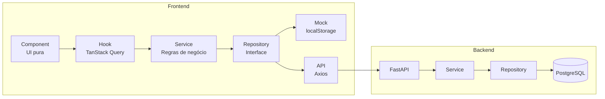
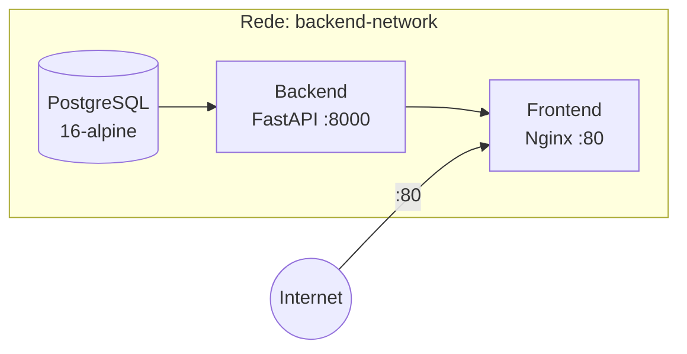

<p align="center">
  
</p>

<h1 align="center">Skill Radar</h1>

<p align="center">
  Plataforma corporativa de assessment técnico multi-stack para validação de conceitos e identificação de gaps por usuário, cargo, squad e setor.
</p>

<p align="center">
  <a href="#-stack"></a>
  <a href="#-stack"></a>
  <a href="#-stack"></a>
  <a href="#-stack"></a>
  <a href="#-stack"></a>
  <a href="#-stack"></a>
  <a href="#-stack"></a>
  <br>
  <a href="#-docker"></a>
  <a href="backend/"></a>
  <a href="frontend/"></a>
  <a href="#-testes"></a>
  <a href="#-testes"></a>
  <a href="LICENSE"></a>
</p>

---

## Sobre

O **Skill Radar** é uma plataforma de assessment técnico que permite:

- **Gerenciar** temas, competências e questões técnicas com suporte a Markdown e Monaco Editor
- **Montar templates de exame** com sorteio dinâmico de questões por tema e senioridade
- **Convidar candidatos** com token de acesso único e código de validação
- **Aplicar exames** com monitoramento de perda de foco e encerramento automático após violações
- **Gerar relatórios** com gráficos de forças e gaps agregados por cargo, squad e setor
- **Exportar resultados** em CSV para análise externa

> O frontend é **100% funcional sem backend** — modo mock com persistência em localStorage ativado por feature flag.

---

## Stack

| Camada | Tecnologias |
| --- | --- |
| **Frontend** | React 19, TypeScript 6.0, Vite 8, MUI 9, React Router 7, Zustand 5, TanStack Query 5, Axios, Monaco Editor, TailwindCSS 4 |
| **Backend** | Python 3.14, FastAPI, PostgreSQL 16 + asyncpg, SQLAlchemy 2.0 (assíncrono), Alembic, JWT (HS256) + argon2, Pydantic v2 |
| **Infra** | Docker Compose, Nginx (proxy reverso), uv (Python), npm |
| **Lint / Formatação** | Ruff (Python), ESLint + TypeScript ESLint (TypeScript) |
| **Testes** | pytest + pytest-asyncio (backend), Vitest + Testing Library (frontend) |

---

## Arquitetura



### Frontend

O frontend segue uma arquitetura em camadas com injeção de dependência:

- **Component** — UI pura, sem lógica de negócio ou acesso a dados
- **Hook** — Adapta services para React via TanStack Query
- **Service** — Regras de negócio, validação e orquestração
- **Repository** — Interface + implementações mock (localStorage) e API (Axios)
- **Store** — Estado global mínimo com Zustand (sessão do usuário, feature flags)

> A troca entre mock e API é transparente via feature flag `enableMockMode` — sem alterar componentes, hooks ou services.

### Backend

O backend segue o padrão **domain-driven** com service → repository:

- **Domain routers** — Descoberta automática via `router_loader.py` (sem registro manual)
- **Service layer** — Lógica de negócio
- **Repository layer** — Consultas SQLAlchemy assíncronas
- **Auth** — JWT (HS256) com argon2, proteção por roles (`ADMIN`, `USER`)
- **Migrations** — Alembic com autogeração
- **Exception handling** — `AppError` + `DefaultResponse` padronizados

### Docker



Em produção com Docker Compose, o **Nginx** serve o build estático do frontend e faz proxy reverso das
requisições `/api/*` para o backend. Apenas o Nginx é exposto externamente (porta 80) — o backend e o
banco rodam em rede interna isolada sem portas expostas.

---

## Estrutura do Projeto

```
skill-radar/
├── backend/
│   ├── Dockerfile
│   ├── .dockerignore
│   ├── app/
│   │   ├── api/v1/           # Rotas da API
│   │   ├── core/             # Configurações, exceções, logging
│   │   ├── db/               # Session, base, migrations Alembic
│   │   ├── domains/          # Domínios (auth, health, candidates, ...)
│   │   └── shared/           # Schemas e constantes
│   ├── tests/                # Testes unitários e de integração
│   └── pyproject.toml
├── frontend/
│   ├── Dockerfile
│   ├── nginx.conf
│   ├── .dockerignore
│   ├── src/
│   │   ├── api/              # Axios instance e interceptors
│   │   ├── components/       # Componentes compartilhados
│   │   ├── hooks/            # Hooks TanStack Query
│   │   ├── layouts/          # AdminLayout, AuthLayout, CandidateLayout
│   │   ├── models/           # Interfaces, enums, tipos
│   │   ├── pages/            # Páginas (admin, exam, auth)
│   │   ├── repositories/     # Mock + Api + interfaces
│   │   ├── routes/           # React Router com lazy loading
│   │   ├── services/         # Serviços com DI
│   │   └── store/            # Zustand stores
│   └── package.json
├── docker-compose.yml
├── .vscode/                  # Launch config (F5 full stack)
├── README.md
└── AGENTS.md                 # Documentação técnica detalhada
```

> Consulte o [AGENTS.md](./AGENTS.md) para documentação detalhada de arquitetura, comandos,
> convenções e modelos de domínio.

---

## Início Rápido

### Docker (recomendado)

Requires Docker Engine 24+ com [Docker Compose plugin](https://docs.docker.com/compose/install/).

```bash
docker compose up -d
```

Acesse `http://localhost` — o Nginx serve o frontend e faz proxy das requisições de API para o
backend. O banco de dados e as migrations são executados automaticamente no startup.

```bash
docker compose logs -f    # Acompanhar logs
docker compose down       # Parar sem destruir dados
docker compose down -v    # Parar e limpar volumes (destrutivo)
```

### Desenvolvimento local

#### Pré-requisitos

- **Python 3.14** + [uv](https://docs.astral.sh/uv/)
- **Node.js 22+** + npm
- **PostgreSQL 16** (apenas se for usar o backend real)

#### Backend

```bash
cd backend
uv sync
cp .env.example .env          # edite as credenciais do PostgreSQL
uv run alembic upgrade head    # aplica migrations
uv run uvicorn app.main:app --reload
```

A API fica disponível em `http://localhost:8000/docs` (Swagger UI).

#### Frontend

```bash
cd frontend
npm install
npm run dev
```

Acesse `http://localhost:3000/login`.

#### Rodar tudo de uma vez

Com o **VS Code**, pressione **F5** — a configuração compound em `.vscode/launch.json` inicia
backend e frontend simultaneamente.


## Feature Flags

Controladas via `frontend/src/feature-flags/`:

| Flag | Default | Descrição |
| --- | --- | --- |
| `enableMockMode` | `true` | Usa mock repositories (frontend autônomo) |
| `enableAuthentication` | `false` | Habilita autenticação real via backend |
| `enableFocusMonitoring` | `true` | Monitora perda de foco no exame |
| `enableAutoTermination` | `true` | Encerra exame após 3 violações |

---

## Testes

```bash
# Backend (pytest)
cd backend && uv run pytest

# Frontend (Vitest)
cd frontend && npm run test
```
